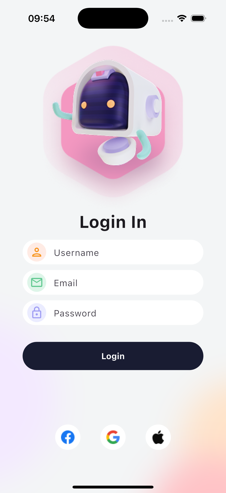
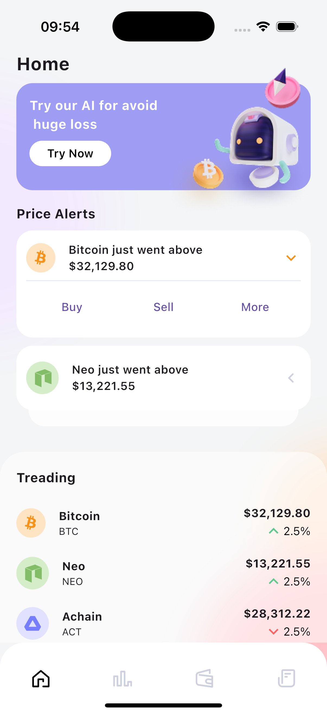
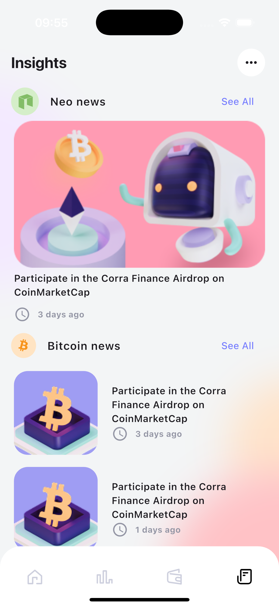
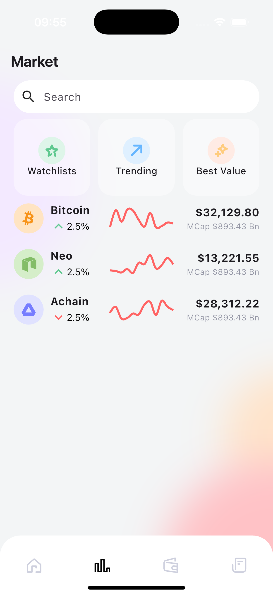

# e-Robo Wallet

A futuristic, AI-driven Web3 wallet UI implementation in Flutter. This project showcases a modern, aesthetic user interface featuring robot illustrations and clean data visualizations.

## UI Overview

The application consists of several polished UI screens, designed to provide a cohesive and futuristic experience:

1.  **Login Screen**: A distinct entry point feature a large robot illustration, setting the theme of the application.
2.  **Home Dashboard**: The central hub displaying total balance, trending assets, and an "AI suggestion" card for loss avoidance.
3.  **Market & Insights**: A dedicated section for market analysis, news updates, and detailed "robo-advisor" insights.
4.  **Wallet History**: A clean list view of past transactions.
5.  **Coin Details**: Detailed view for individual assets including charts and specific metrics.
6.  **Price Alerts**: Interface for setting and managing price thresholds for cryptocurrencies.

## Project Structure

The project code in `lib/` is organized to separate concerns effectively:

-   `constant/`: Static data and configuration constants (e.g., dummy data for the UI).
-   `entity/`: Data models defining the structure of coins, assets, and other business entities.
-   `gen/`: Auto-generated code for asset management (images, fonts).
-   `presentation/`: The core UI code, organized by feature (e.g., `home`, `login`, `market`).
    -   Each feature folder typically contains the main page and screen-specific widgets.
-   `router/`: Navigation configuration using `go_router`.
-   `widget/`: Reusable common widgets shared across different screens.

## Design Resources

-   **UI Design Source**: Figma Community - E-Robo Wallet – Crypto iOS UI Kit (Community)

## UI Showcase

The application features high-quality 3D assets to create an engaging user experience:

| Login | Home | Insights | Market |
|:---:|:---:|:---:|:---:|
|  |  |  |  |

*(Note: These are key assets used in the application interactions. Run the app to see the full UI composition.)*

## Getting Started

1. **Prerequisites**: Ensure you have Flutter installed. [Flutter Installation Guide](https://flutter.dev/docs/get-started/install)
2. **Clone the repository**:
   ```bash
   git clone https://github.com/JiuShuang/flutter_beautiful_ui
   cd flutter_beautiful_ui/E-Robo-Wallet
   ```
3. **Install Dependencies**:
   ```bash
   flutter pub get
   ```
4. **Run the App**:
   ```bash
   flutter run
   ```

## Dependencies

- `go_router`: For navigation.
- `fl_chart`: For charts and graphs.
- `flutter_svg`: For SVG asset rendering.
