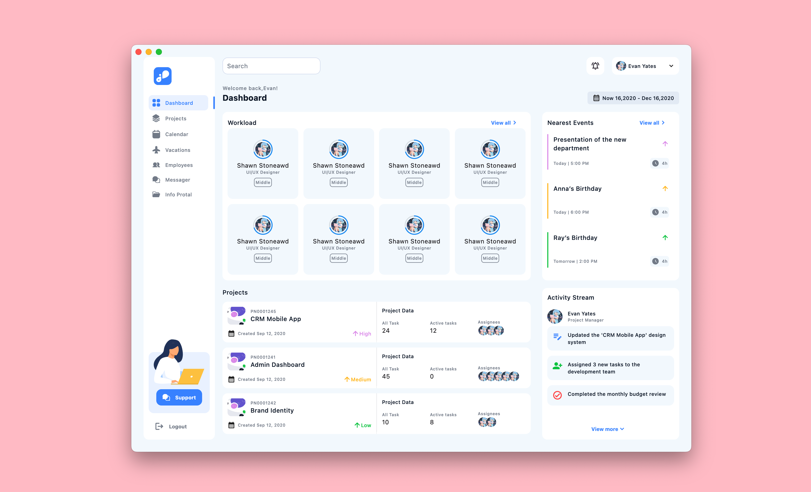
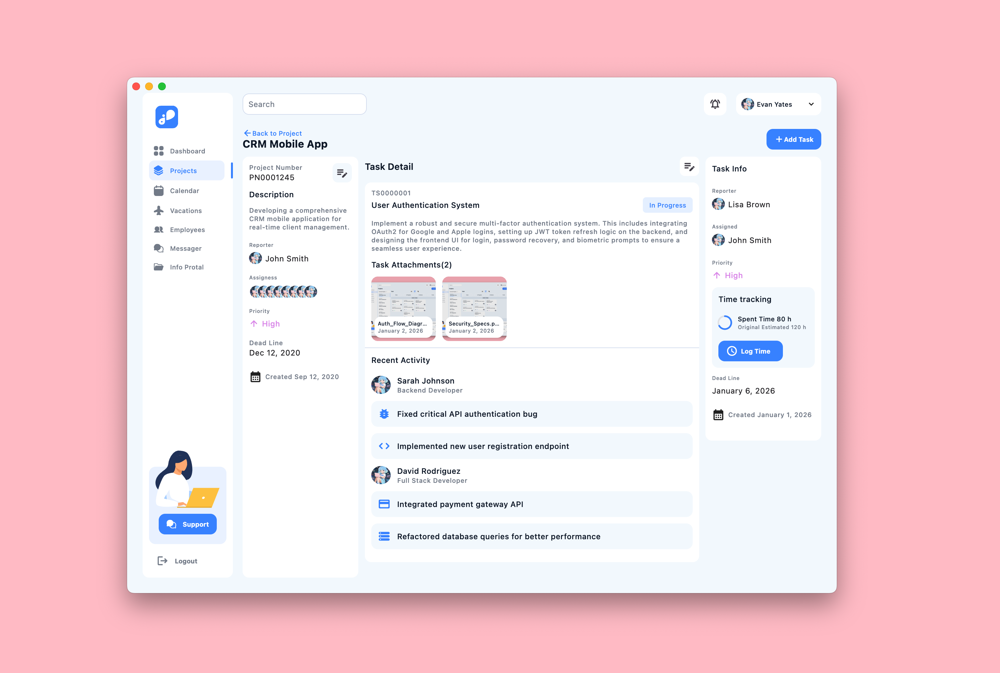
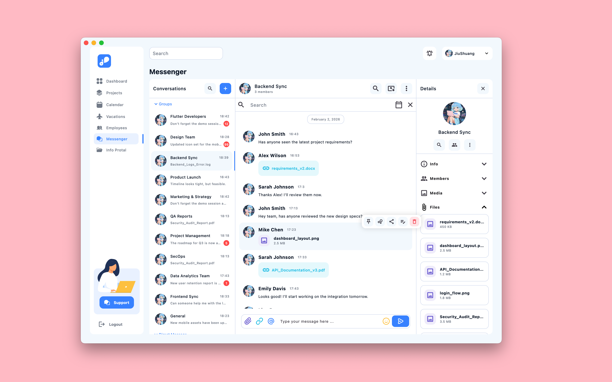
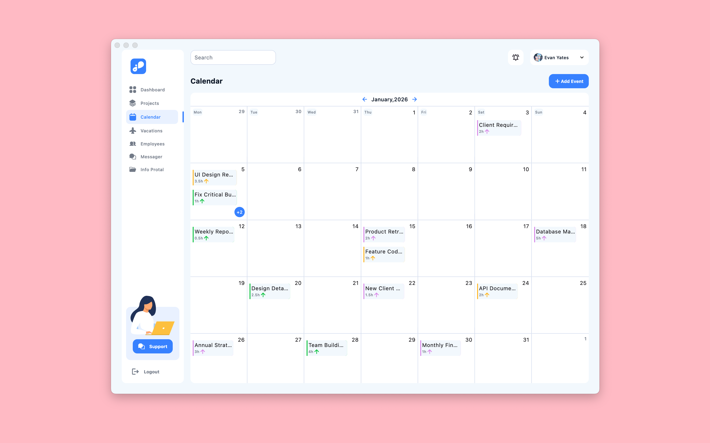
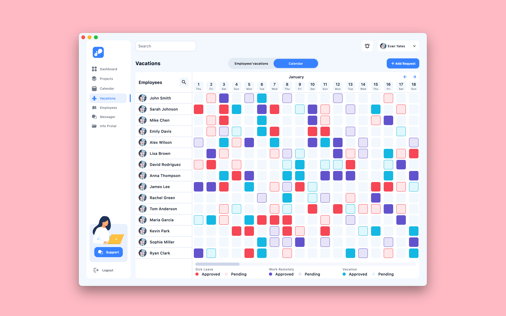
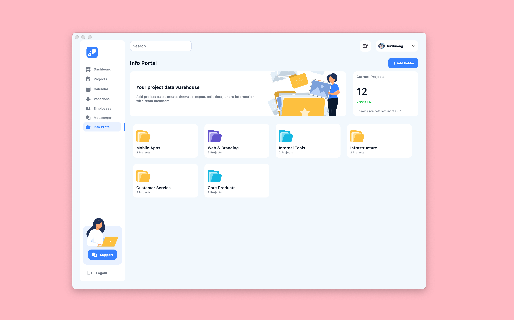
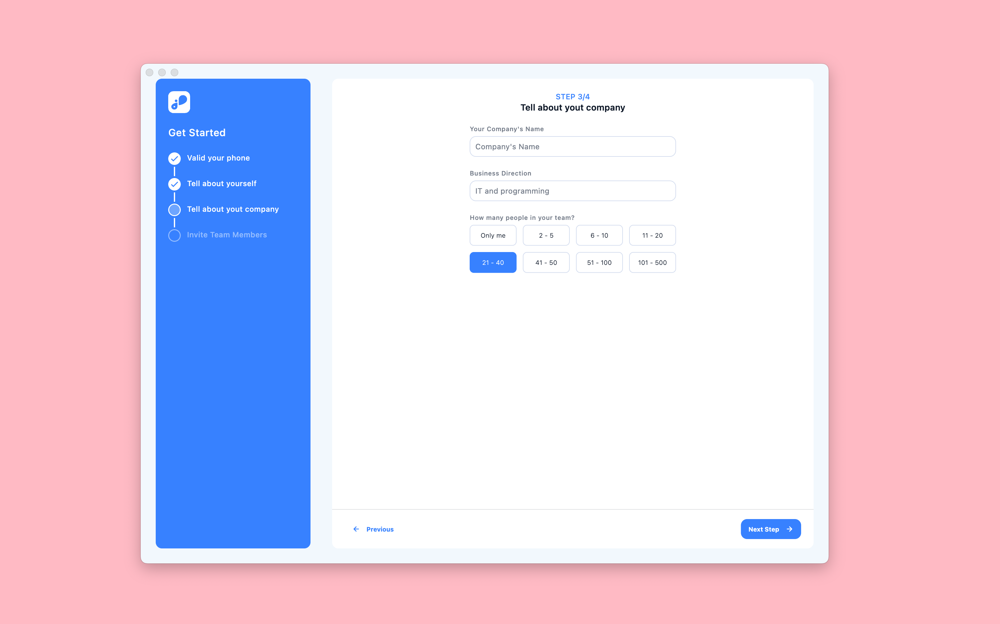
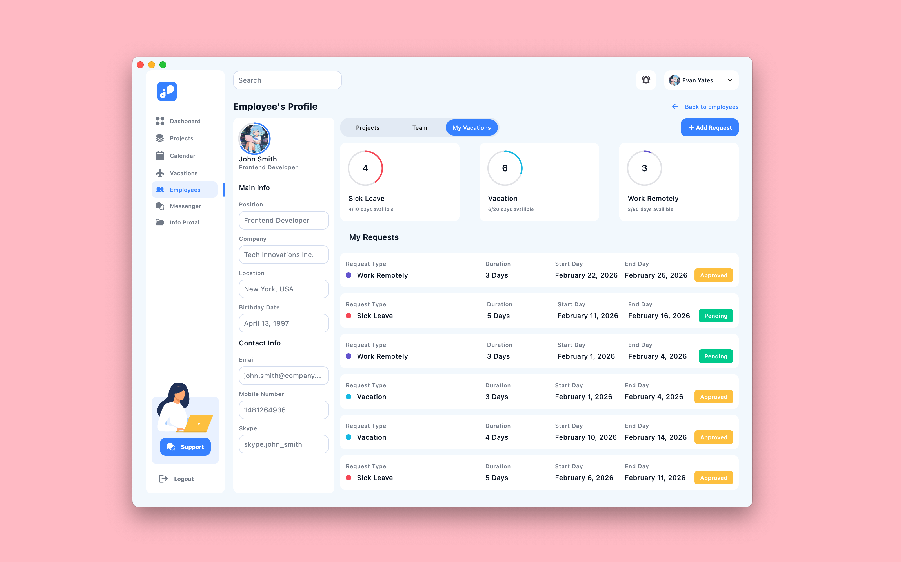

# CRM Woorkroom

**CRM Woorkroom** is a high-fidelity CRM system UI showcase built with Flutter. This project focuses on delivering a modern, professional, and aesthetically pleasing business management interface, featuring UI implementations for project tracking, messaging, and HR management.

## UI Overview

The application consists of several polished UI screens:

1. **Login Screen**: Minimalist authentication with smooth animations.
2. **Dashboard**: Insightful metrics and recent activities at a glance.
3. **Projects**: Comprehensive task management with multi-view support.
4. **Calendar**: Team scheduling and deadline tracking.
5. **Messaging**: Real-time chat with session persistence.
6. **Vacations**: Streamlined leave management for HR and employees.
7. **Portal**: Organized file system and resource sharing.
8. **Profile**: Personalized settings and user information.

## Project Structure

The codebase follows a clear separation of concerns in `lib/`:

*   `constant/`: Styling tokens, themes, and mock data.
*   `entity/`: Core business models (Projects, Tasks, Messages).
*   `presentation/`: Feature-based UI modules (Auth, Projects, Messenger, etc.).
*   `presentation/widgets/`: Atomic UI components used throughout the system.

## Design Resources

*   **UI Design Source**: Figma - CRM Woorkroom (Community)

## UI Showcase

| Dashboard | Projects |
|:---:|:---:|
|  |  |

| Messenger | Calendar |
|:---:|:---:|
|  |  |

| Vacations | Portal |
|:---:|:---:|
|  |  |

| Auth | Profile |
|:---:|:---:|
|  |  |

---

## Getting Started

1. **Prerequisites**: Ensure you have Flutter installed. [Flutter Installation Guide](https://flutter.dev/docs/get-started/install)
2. **Setup**:
```bash
git clone https://github.com/JiuShuang/flutter_beautiful_ui
cd crm_woorkroom
flutter pub get
```
3. **Execution**:
```bash
flutter run
```

## Dependencies

*   `flutter_svg`: Vector graphics rendering.
*   `window_manager`: Native desktop window control.
