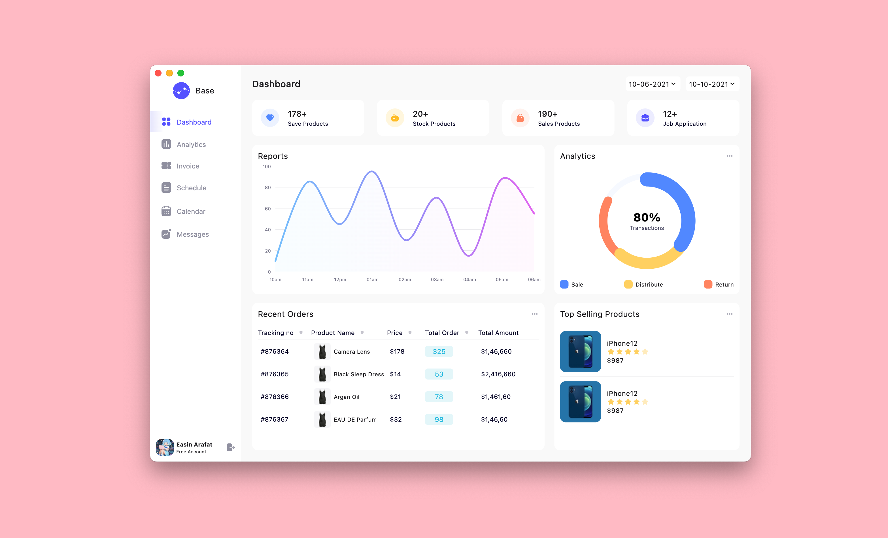
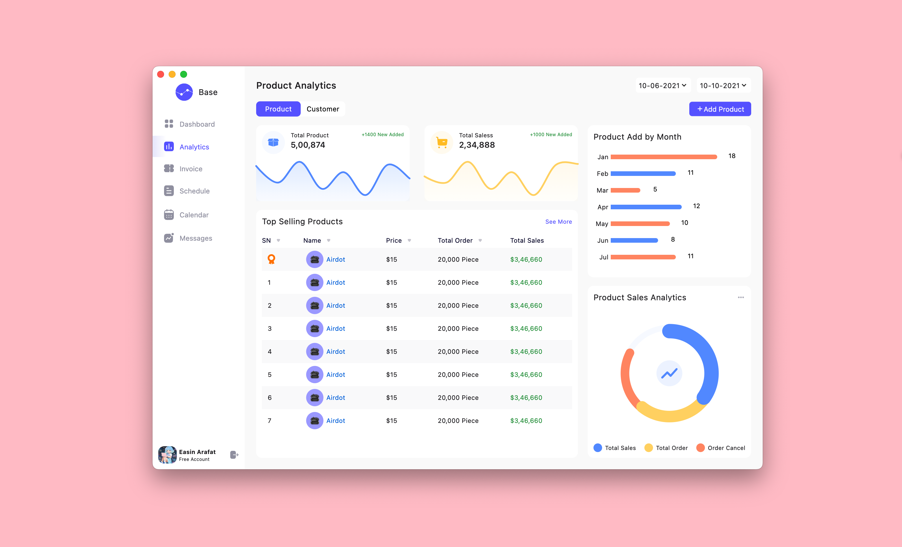
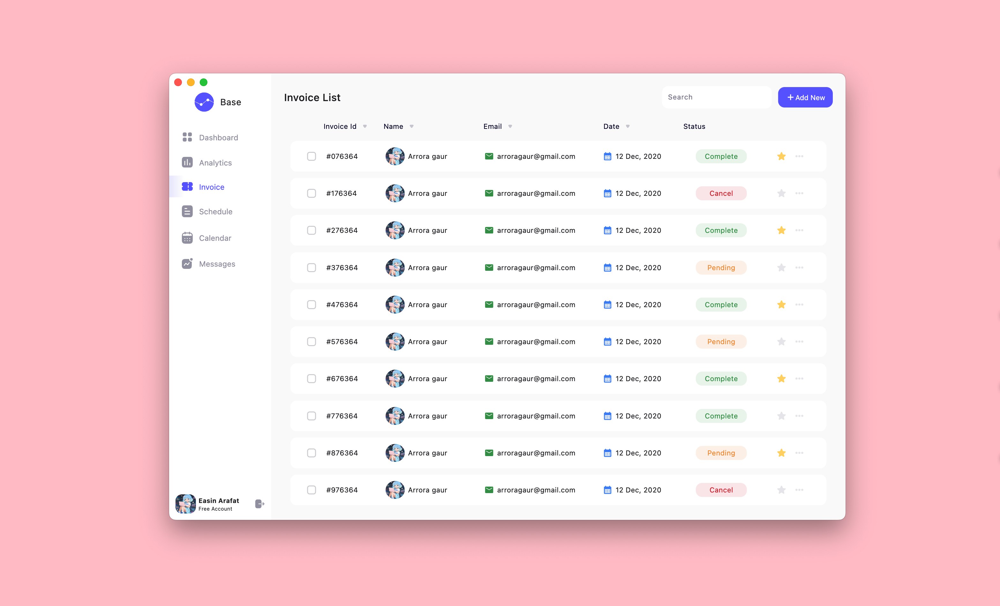
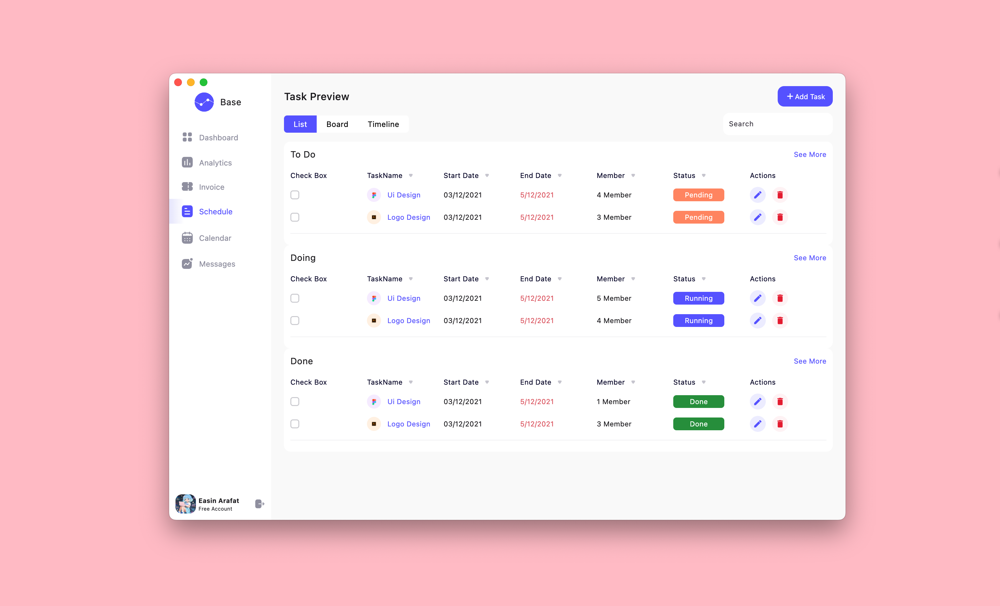
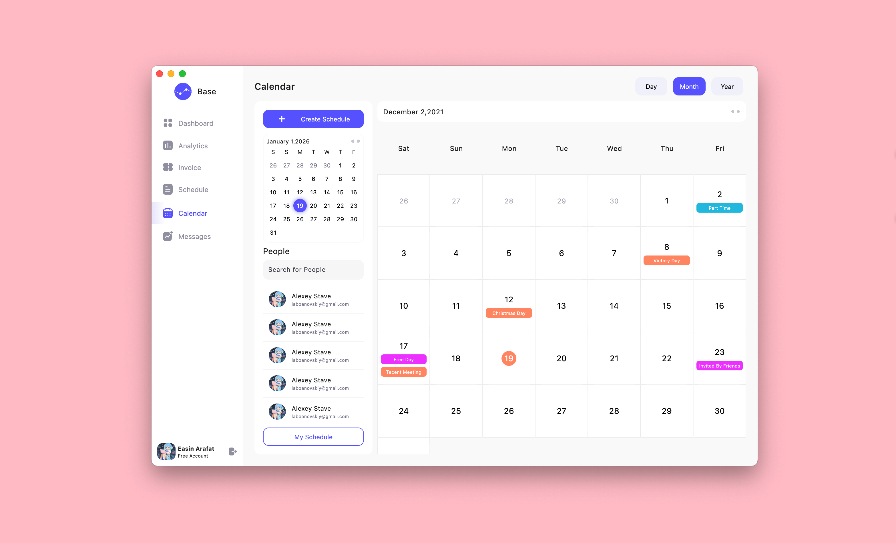
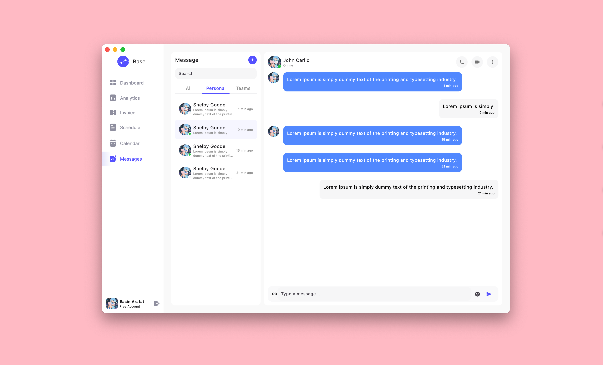

# SaaS Dashboard

A modern, comprehensive SaaS dashboard application built with Flutter. This project showcases a clean, professional user interface with multiple management modules including analytics, scheduling, messaging, and more.

## UI Overview

The application consists of several polished UI screens designed to provide a cohesive business management experience:

1. **Login Screen**: Clean authentication interface with smooth animations and modern design elements.
2. **Dashboard**: Central hub displaying key metrics, recent orders, top-selling products, and summary statistics.
3. **Analytics**: Comprehensive data visualization with interactive charts, customer insights, and product performance metrics.
4. **Invoice Management**: Professional invoice tracking and management system with status indicators and search functionality.
5. **Task Scheduling**: Kanban-style task management with todo, doing, and done columns for project workflow.
6. **Calendar**: Event scheduling and calendar management interface with priority levels and time tracking.
7. **Messaging**: Real-time messaging system with session management and user status indicators.

## Project Structure

The project code in `lib/` is organized to separate concerns effectively:

- `constant/`: Static data and configuration constants (e.g., app colors, themes, mock data for UI).
- `entity/`: Data models defining the structure of analytics, calendar events, invoices, and other business entities.
- `gen/`: Auto-generated code for asset management (images, fonts).
- `presentation/`: The core UI code, organized by feature (e.g., `dashboard`, `analytics`, `auth`).
  - Each feature folder typically contains the main page and screen-specific widgets.
- `widget/`: Reusable common widgets shared across different screens.

## Design Resources

- **UI Design Source**: Figma - SAAS Dashboard designed by wittyu

## UI Showcase

The application features a professional dark theme design to create an engaging business management experience:

| Dashboard | Analytics |
|:---:|:---:|
|  |  |

| Invoice | Schedule |
|:---:|:---:|
|  |  |

| Calendar | Messages |
|:---:|:---:|
|  |  |

*(Note: These are key screens used in the application. Run the app to see the full UI composition.)*

## Getting Started

1. **Prerequisites**: Ensure you have Flutter installed. [Flutter Installation Guide](https://flutter.dev/docs/get-started/install)

2. **Clone the repository**:
```bash
git clone <repository-url>
cd saas_dashboard
```

3. **Install Dependencies**:
```bash
flutter pub get
```

4. **Run the App**:
```bash
flutter run
```

## Dependencies

- `flutter_svg`: For SVG asset rendering.
- `fl_chart`: For charts and graphs.
- `window_manager`: For desktop window management.